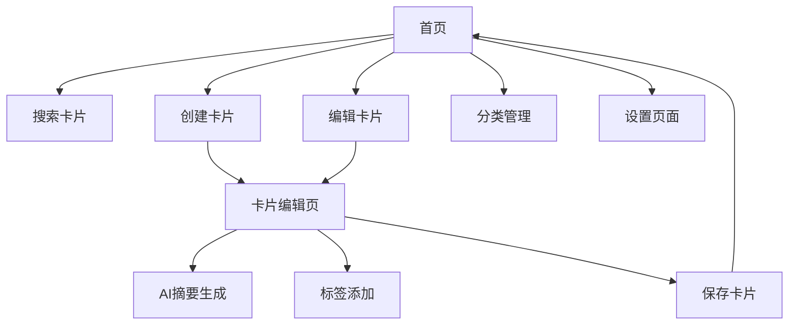

## 1. 产品概述
智能知识卡片管理应用，通过AI技术实现智能摘要生成和高效知识管理。帮助用户快速整理、分类和检索知识内容，支持多设备协同工作。

目标用户：学生、研究人员、职场人士等需要管理大量知识信息的用户。

## 2. 核心功能

### 2.1 用户角色
| 角色 | 注册方式 | 核心权限 |
|------|----------|----------|
| 普通用户 | 邮箱注册 | 创建、编辑、搜索知识卡片，使用AI摘要功能 |
| 高级用户 | 付费升级 | 无限卡片创建，高级AI功能，多设备同步 |

### 2.2 功能模块
应用包含以下主要页面：
1. **首页**：卡片展示、搜索栏、快速创建入口
2. **卡片编辑页**：内容编辑、AI摘要生成、标签管理
3. **分类管理页**：分类创建、编辑、卡片归类
4. **设置页**：账户管理、同步设置、存储管理

### 2.3 页面详情
| 页面名称 | 模块名称 | 功能描述 |
|----------|----------|----------|
| 首页 | 卡片展示区 | 以网格/列表形式展示知识卡片，支持缩略图预览 |
| 首页 | 搜索栏 | 支持关键词搜索、标签筛选、分类筛选 |
| 首页 | 快速创建 | 一键创建新卡片，支持文本、图片、链接输入 |
| 卡片编辑页 | 内容编辑器 | 富文本编辑，支持Markdown，实时保存 |
| 卡片编辑页 | AI摘要生成 | 自动生成内容摘要，支持手动调整 |
| 卡片编辑页 | 标签管理 | 添加/删除标签，智能标签推荐 |
| 分类管理页 | 分类列表 | 展示所有分类，支持拖拽排序 |
| 分类管理页 | 卡片归类 | 批量移动卡片到指定分类 |
| 设置页 | 账户管理 | 个人信息修改，订阅管理 |
| 设置页 | 同步设置 | 设备管理，同步频率设置 |

## 3. 核心流程

## 4. 用户界面设计

### 4.1 设计风格
- **主色调**：深蓝色 (#2563eb) + 白色背景
- **辅助色**：浅灰色 (#f3f4f6) + 绿色成功状态 (#10b981)
- **按钮风格**：圆角矩形，悬浮效果
- **字体**：系统默认字体，标题16px，正文14px
- **布局风格**：卡片式布局，左侧导航栏
- **图标风格**：线性图标，简洁现代

### 4.2 页面设计概述
| 页面名称 | 模块名称 | UI元素 |
|----------|----------|--------|
| 首页 | 卡片展示区 | 网格布局，每张卡片显示标题、摘要、标签，卡片间距16px，响应式列数 |
| 首页 | 搜索栏 | 顶部固定，圆角搜索框，宽度80%，包含搜索图标和筛选按钮 |
| 卡片编辑页 | 内容编辑器 | 全屏编辑模式，左侧内容区，右侧工具栏，顶部操作栏 |
| 分类管理页 | 分类列表 | 树形结构展示，支持折叠展开，每个分类显示卡片数量 |

### 4.3 响应式设计
桌面端优先设计，适配平板和手机端：
- 桌面端：多列网格布局，完整功能展示
- 平板端：双列布局，简化导航
- 手机端：单列布局，底部导航栏

### 4.4 交互优化
- 卡片拖拽排序
- 快速预览（悬浮卡片）
- 键盘快捷键支持
- 加载动画和过渡效果