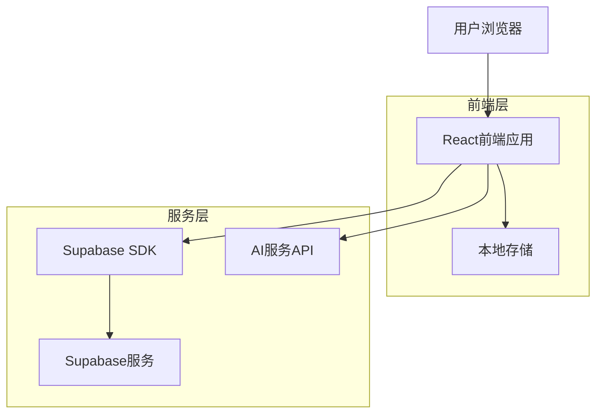
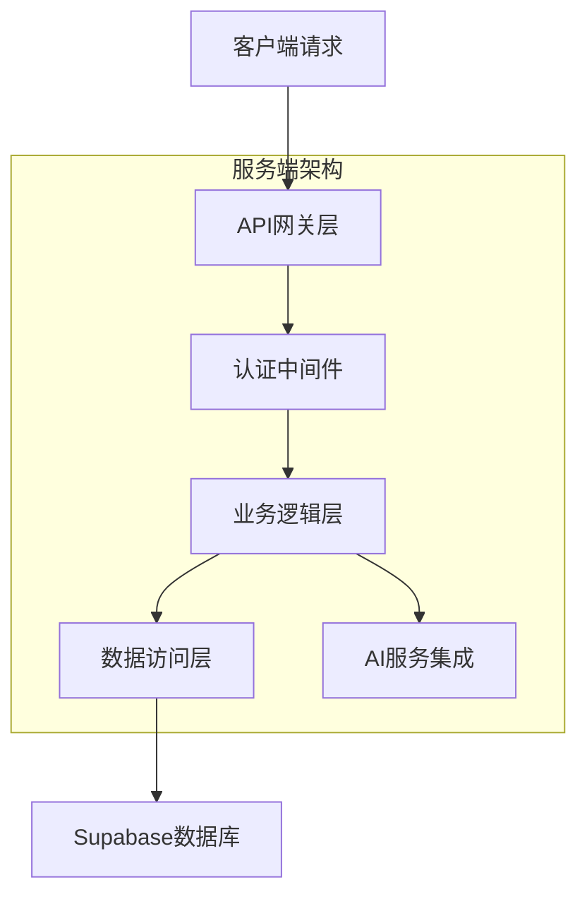
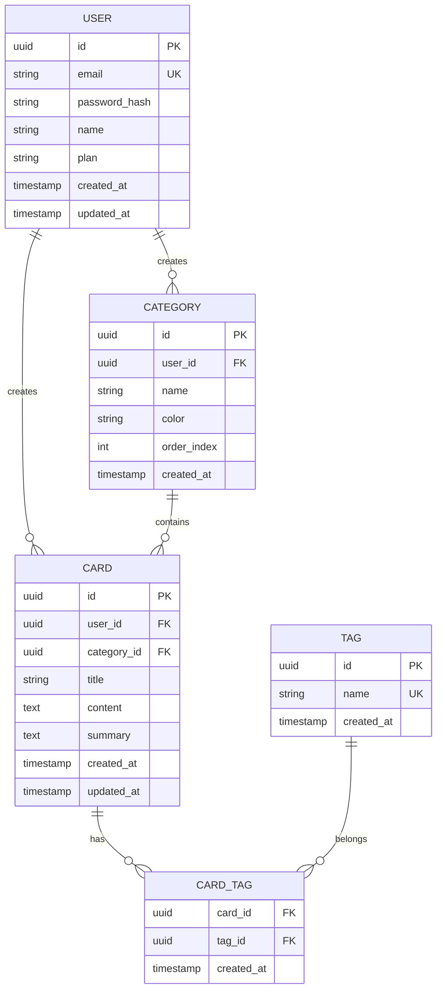

## 1. 架构设计



## 2. 技术描述

- **前端**: React@18 + TypeScript + TailwindCSS@3 + Vite
- **初始化工具**: vite-init
- **后端**: Supabase (提供认证、数据库、存储服务)
- **AI服务**: OpenAI API (用于摘要生成和关键词提取)
- **本地存储**: IndexedDB + localStorage (用于离线缓存)
- **状态管理**: Zustand (轻量级状态管理)
- **UI组件**: HeadlessUI + Radix UI

## 3. 路由定义

| 路由 | 用途 |
|------|------|
| / | 首页，卡片展示和搜索 |
| /login | 登录页面 |
| /register | 注册页面 |
| /card/new | 创建新卡片 |
| /card/:id | 编辑指定卡片 |
| /categories | 分类管理 |
| /settings | 设置页面 |
| /sync | 设备同步管理 |

## 4. API定义

### 4.1 认证相关API

```
POST /api/auth/login
```

请求：
| 参数名 | 参数类型 | 是否必需 | 描述 |
|--------|----------|----------|------|
| email | string | 是 | 用户邮箱 |
| password | string | 是 | 密码 |

响应：
| 参数名 | 参数类型 | 描述 |
|--------|----------|------|
| token | string | JWT令牌 |
| user | object | 用户信息 |

### 4.2 卡片管理API

```
GET /api/cards
```

查询参数：
| 参数名 | 参数类型 | 描述 |
|--------|----------|------|
| search | string | 搜索关键词 |
| category | string | 分类筛选 |
| tags | array | 标签筛选 |
| page | number | 页码 |
| limit | number | 每页数量 |

```
POST /api/cards
```

请求体：
| 参数名 | 参数类型 | 是否必需 | 描述 |
|--------|----------|----------|------|
| title | string | 是 | 卡片标题 |
| content | string | 是 | 卡片内容 |
| tags | array | 否 | 标签数组 |
| category | string | 否 | 分类ID |

### 4.3 AI服务API

```
POST /api/ai/summary
```

请求体：
| 参数名 | 参数类型 | 是否必需 | 描述 |
|--------|----------|----------|------|
| content | string | 是 | 需要摘要的内容 |
| maxLength | number | 否 | 摘要最大长度 |

```
POST /api/ai/keywords
```

请求体：
| 参数名 | 参数类型 | 是否必需 | 描述 |
|--------|----------|----------|------|
| content | string | 是 | 需要提取关键词的内容 |
| count | number | 否 | 关键词数量 |

## 5. 服务器架构图



## 6. 数据模型

### 6.1 数据模型定义



### 6.2 数据定义语言

用户表 (users)
```sql
-- 创建表
CREATE TABLE users (
    id UUID PRIMARY KEY DEFAULT gen_random_uuid(),
    email VARCHAR(255) UNIQUE NOT NULL,
    password_hash VARCHAR(255) NOT NULL,
    name VARCHAR(100) NOT NULL,
    plan VARCHAR(20) DEFAULT 'free' CHECK (plan IN ('free', 'premium')),
    created_at TIMESTAMP WITH TIME ZONE DEFAULT NOW(),
    updated_at TIMESTAMP WITH TIME ZONE DEFAULT NOW()
);

-- 创建索引
CREATE INDEX idx_users_email ON users(email);
CREATE INDEX idx_users_plan ON users(plan);
```

知识卡片表 (cards)
```sql
-- 创建表
CREATE TABLE cards (
    id UUID PRIMARY KEY DEFAULT gen_random_uuid(),
    user_id UUID NOT NULL REFERENCES users(id) ON DELETE CASCADE,
    category_id UUID REFERENCES categories(id) ON DELETE SET NULL,
    title VARCHAR(255) NOT NULL,
    content TEXT NOT NULL,
    summary TEXT,
    created_at TIMESTAMP WITH TIME ZONE DEFAULT NOW(),
    updated_at TIMESTAMP WITH TIME ZONE DEFAULT NOW()
);

-- 创建索引
CREATE INDEX idx_cards_user_id ON cards(user_id);
CREATE INDEX idx_cards_category_id ON cards(category_id);
CREATE INDEX idx_cards_created_at ON cards(created_at DESC);
CREATE INDEX idx_cards_title ON cards(title);
```

分类表 (categories)
```sql
-- 创建表
CREATE TABLE categories (
    id UUID PRIMARY KEY DEFAULT gen_random_uuid(),
    user_id UUID NOT NULL REFERENCES users(id) ON DELETE CASCADE,
    name VARCHAR(100) NOT NULL,
    color VARCHAR(7) DEFAULT '#2563eb',
    order_index INTEGER DEFAULT 0,
    created_at TIMESTAMP WITH TIME ZONE DEFAULT NOW()
);

-- 创建索引
CREATE INDEX idx_categories_user_id ON categories(user_id);
CREATE INDEX idx_categories_order ON categories(order_index);
```

标签表 (tags)
```sql
-- 创建表
CREATE TABLE tags (
    id UUID PRIMARY KEY DEFAULT gen_random_uuid(),
    name VARCHAR(50) UNIQUE NOT NULL,
    created_at TIMESTAMP WITH TIME ZONE DEFAULT NOW()
);

-- 创建索引
CREATE INDEX idx_tags_name ON tags(name);
```

卡片标签关联表 (card_tags)
```sql
-- 创建表
CREATE TABLE card_tags (
    card_id UUID NOT NULL REFERENCES cards(id) ON DELETE CASCADE,
    tag_id UUID NOT NULL REFERENCES tags(id) ON DELETE CASCADE,
    created_at TIMESTAMP WITH TIME ZONE DEFAULT NOW(),
    PRIMARY KEY (card_id, tag_id)
);

-- 创建索引
CREATE INDEX idx_card_tags_card_id ON card_tags(card_id);
CREATE INDEX idx_card_tags_tag_id ON card_tags(tag_id);
```

### 6.3 Supabase访问权限

```sql
-- 匿名用户权限（基本读取）
GRANT SELECT ON cards TO anon;
GRANT SELECT ON categories TO anon;
GRANT SELECT ON tags TO anon;

-- 认证用户权限（完全访问）
GRANT ALL PRIVILEGES ON cards TO authenticated;
GRANT ALL PRIVILEGES ON categories TO authenticated;
GRANT ALL PRIVILEGES ON tags TO authenticated;
GRANT ALL PRIVILEGES ON card_tags TO authenticated;

-- 行级安全策略
ALTER TABLE cards ENABLE ROW LEVEL SECURITY;
ALTER TABLE categories ENABLE ROW LEVEL SECURITY;

-- 卡片访问策略
CREATE POLICY "用户只能访问自己的卡片" ON cards
    FOR ALL USING (auth.uid() = user_id);

-- 分类访问策略
CREATE POLICY "用户只能访问自己的分类" ON categories
    FOR ALL USING (auth.uid() = user_id);
```